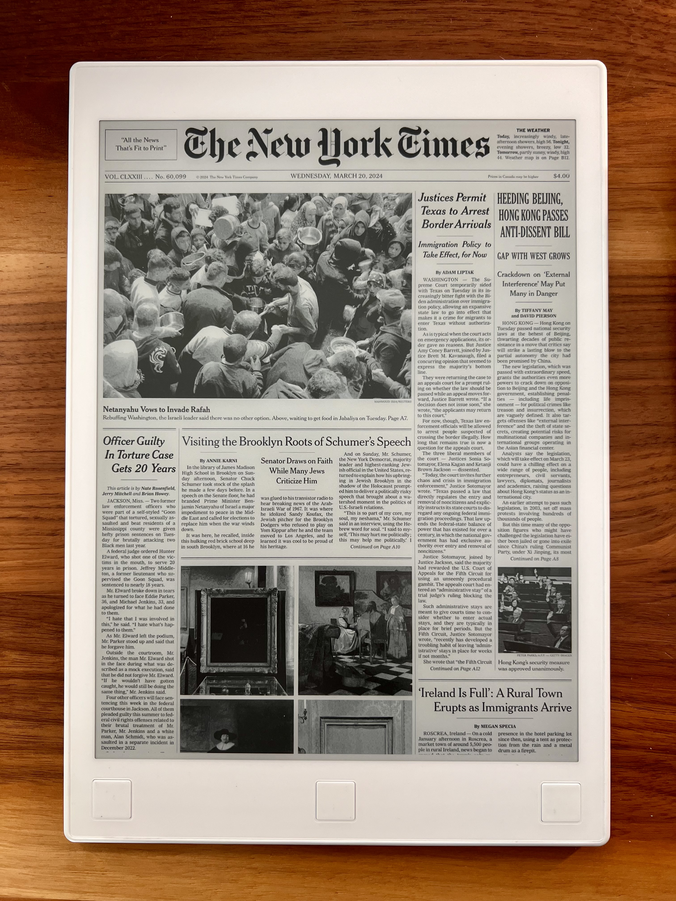

# remarkable-suspend-images

The `images` directory contains images that are appropriately sized for the suspend image on remarkable tablets. The `image-scripts` directory contains scripts that automatically generate some of the images in the images directory. 

Use these images as replacements for `/usr/share/remarkable/suspended.png`
